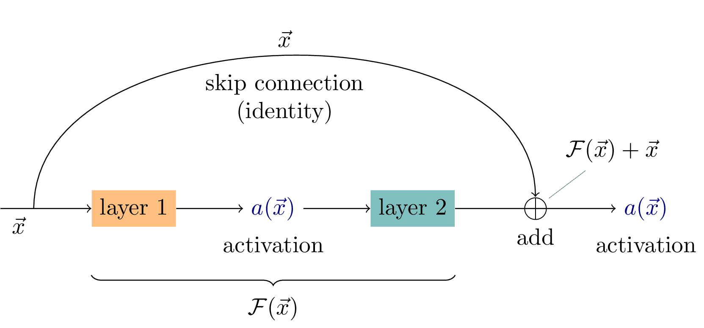

# ResNet: Explorando Blocos Residuais e Conexões de Atalho

## 1. Introdução

A Rede Residual, ou ResNet, é uma inovação no campo do aprendizado profundo que aborda o problema do desaparecimento do gradiente, comum em redes neurais profundas. Desenvolvida por Kaiming He et al. em 2015, a ResNet introduziu "conexões de atalho" que permitem a retropropagação direta do gradiente para camadas anteriores. Isso possibilitou o treinamento de redes com até 152 camadas, um avanço significativo em relação às redes anteriores que tinham apenas 20 a 30 camadas. A ResNet tem demonstrado desempenho superior em várias tarefas de visão computacional e tem sido amplamente adotada na comunidade de aprendizado profundo.

## 2. Compreendendo a ResNet

A ResNet foi desenvolvida para resolver o problema do desaparecimento do gradiente, que ocorre quando os gradientes durante a retropropagação se tornam cada vez menores à medida que a profundidade da rede aumenta. Isso resulta em um aprendizado muito lento nas primeiras camadas da rede.

A ResNet aborda esse problema através da introdução de "conexões de atalho", que são implementadas como identidades de mapeamento. Isso significa que a saída de uma camada é adicionada à saída de uma camada anterior, permitindo que a rede aprenda funções de identidade e facilitando o treinamento de redes mais profundas.

## 3. Arquitetura da ResNet

A arquitetura da ResNet é composta por uma série de blocos residuais, que são a unidade fundamental de construção da rede. Existem dois tipos principais de blocos residuais na ResNet: blocos de identidade e blocos convolucionais.

### 3.1 Blocos Residuais

Um bloco residual é uma estrutura na qual a saída de uma camada é adicionada à saída de uma ou mais camadas posteriores. Isso cria uma "conexão de atalho" que permite que o gradiente seja diretamente retropropagado para camadas anteriores. Essas conexões de atalho ajudam a mitigar o problema do desaparecimento do gradiente, permitindo que a rede aprenda funções de identidade.

### 3.2 Blocos de Identidade

Os blocos de identidade são usados quando a dimensão da entrada e da saída do bloco é a mesma. Em outras palavras, a saída do bloco anterior pode ser diretamente adicionada à saída do bloco atual. Isso é efetivamente uma "conexão de atalho" que permite que a entrada "pule" a camada. Matematicamente, isso pode ser representado como:

$$y = F(x, {W_i}) + x$$

onde $x$ é a entrada, $y$ é a saída, e $F(x, {W_i})$ representa as operações realizadas no bloco (como convoluções, normalizações de lote e ativações).

### 3.3 Blocos Convolucionais

Os blocos convolucionais são usados quando a dimensão da entrada e da saída é diferente. Nesse caso, a entrada é transformada por meio de uma operação de convolução antes de ser adicionada à saída. Isso pode ser representado como:

$$y = F(x, {W_i}) + W_sx$$

onde $W_s$ é uma matriz de pesos que transforma a entrada para que ela tenha a mesma dimensão que a saída de $F(x, {W_i})$. Isso permite que a entrada seja adicionada diretamente à saída do bloco.

### 3.4 Conexões de Atalho (Skip Connections)

As conexões de atalho são uma característica importante da ResNet. Elas permitem que o gradiente seja diretamente retropropagado para camadas anteriores. Isso é feito adicionando a saída de uma camada anterior à saída de uma camada posterior. Essas conexões de atalho ajudam a mitigar o problema do desaparecimento do gradiente, permitindo que a rede aprenda funções de identidade.

### 3.5 Função de Ativação ReLU e Normalização de Lote

Após cada camada convolucional na ResNet, a função de ativação ReLU é aplicada. A função ReLU ajuda a introduzir a não linearidade na rede, o que permite que a rede aprenda funções mais complexas. A função ReLU é definida como:

$$f(x) = max(0, x)$$

Além disso, a normalização de lote é usada após cada camada convolucional. A normalização de lote ajuda a acelerar o treinamento, reduzindo o deslocamento da covariância interna. Ela normaliza a saída de uma camada anterior, o que garante que a rede sempre recebe dados com a mesma distribuição. A normalização de lote é definida como:

$$y = \frac{x - E[x]}{\sqrt{Var[x] + \epsilon}} * \gamma + \beta$$

onde $E[x]$ é a média dos elementos de $x$, $Var[x]$ é a variância dos elementos de $x$, $\epsilon$ é um número pequeno para estabilidade numérica, e $\gamma$ e $\beta$ são parâmetros aprendidos.

## 4. Conclusão

A ResNet, ou Rede Residual, revolucionou o campo do aprendizado profundo ao introduzir "conexões de atalho" que permitem a retropropagação direta do gradiente para camadas anteriores. Isso possibilitou o treinamento de redes com até 152 camadas, um avanço significativo em relação às redes anteriores que tinham apenas 20 a 30 camadas.

Os blocos residuais, que são a unidade fundamental de construção da ResNet, são compostos por blocos de identidade e blocos convolucionais. A função de ativação ReLU é aplicada após cada camada convolucional, e a normalização de lote é usada para acelerar o treinamento.

A ResNet tem demonstrado desempenho superior em várias tarefas de visão computacional e tem sido amplamente adotada na comunidade de aprendizado profundo. O impacto da ResNet no campo do aprendizado profundo é inegável, e seu uso continuará a crescer no futuro.

A ResNet abriu o caminho para o desenvolvimento de redes neurais ainda mais profundas e eficazes. Com o contínuo avanço da tecnologia e o aumento da disponibilidade de dados, é provável que vejamos ainda mais melhorias e inovações no campo do aprendizado profundo.

## 5. Referências

[1]. Fukushima, K. (1980). *Neocognitron: A Self-organizing Neural Network Model for a Mechanism of Pattern Recognition Unaffected by Shift in Position*. Biological Cybernetics, 36(4), 193–202.

[2]. LeCun, Y., Bottou, L., Bengio, Y., & Haffner, P. (1998). *Gradient-based learning applied to document recognition*. Proceedings of the IEEE, 86(11), 2278–2324.

[3]. He, K., Zhang, X., Ren, S., & Sun, J. (2015). *Deep Residual Learning for Image Recognition*. In Proceedings of the IEEE conference on computer vision and pattern recognition (pp. 770–778).

[4]. He, K., Zhang, X., Ren, S., & Sun, J. (2016). *Identity Mappings in Deep Residual Networks*. In Proceedings of the European conference on computer vision (pp. 630–645).

[5]. Ioffe, S., & Szegedy, C. (2015). *Batch Normalization: Accelerating Deep Network Training by Reducing Internal Covariate Shift*. In Proceedings of the 32nd International Conference on Machine Learning (pp. 448–456).
